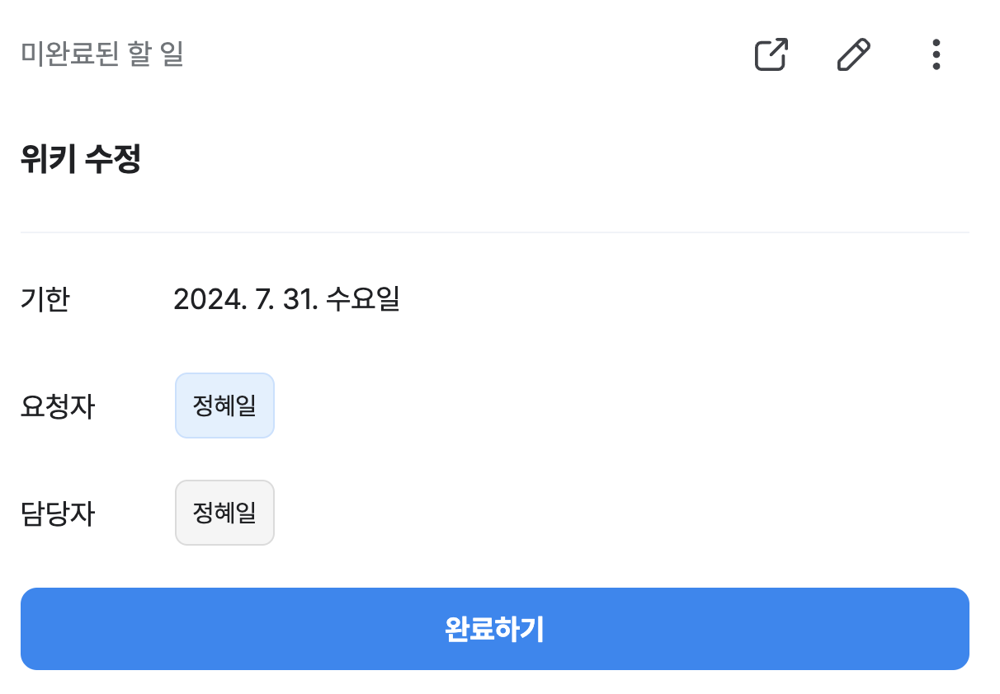
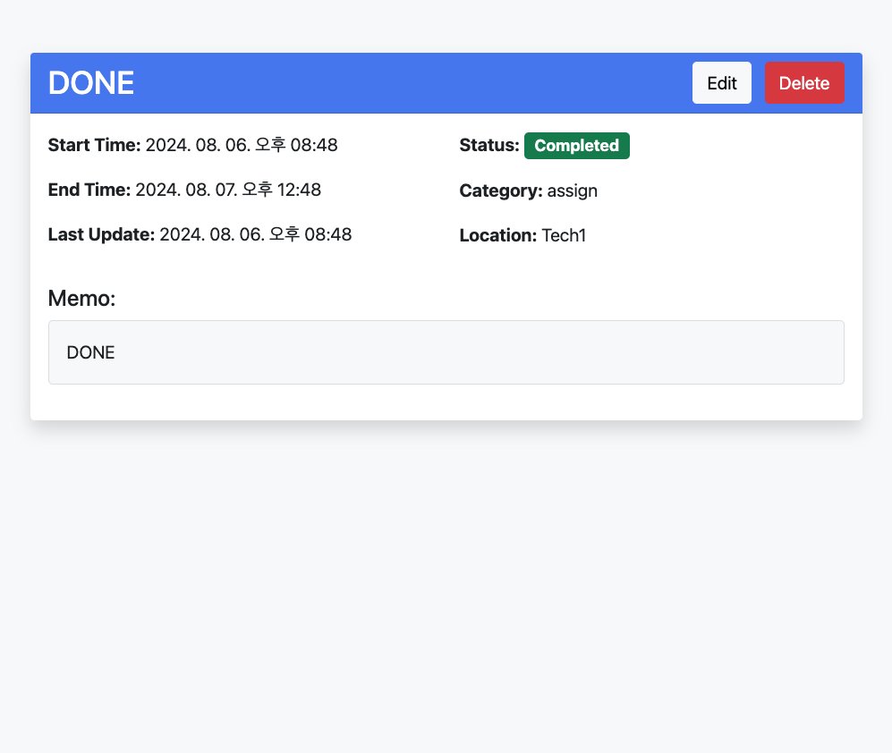
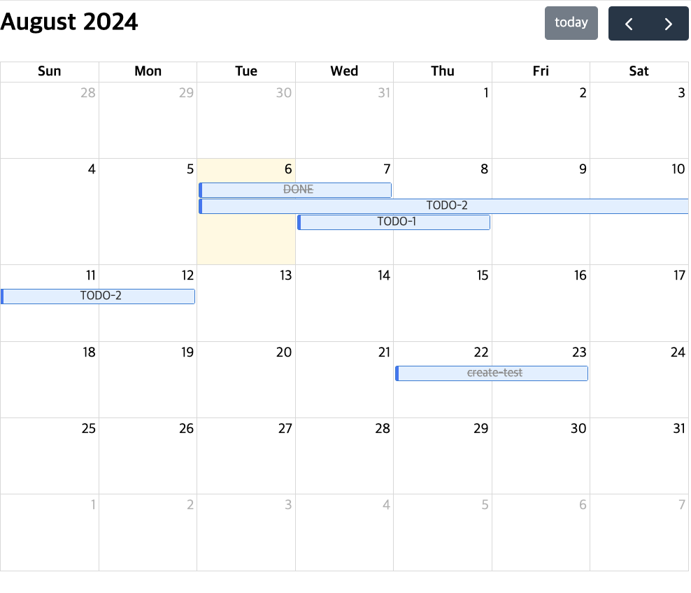
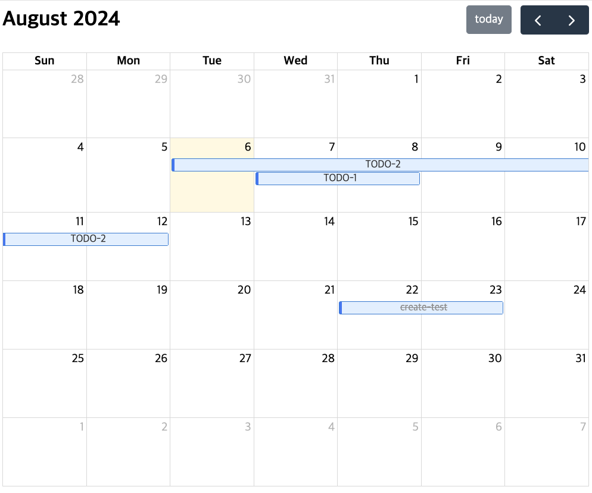
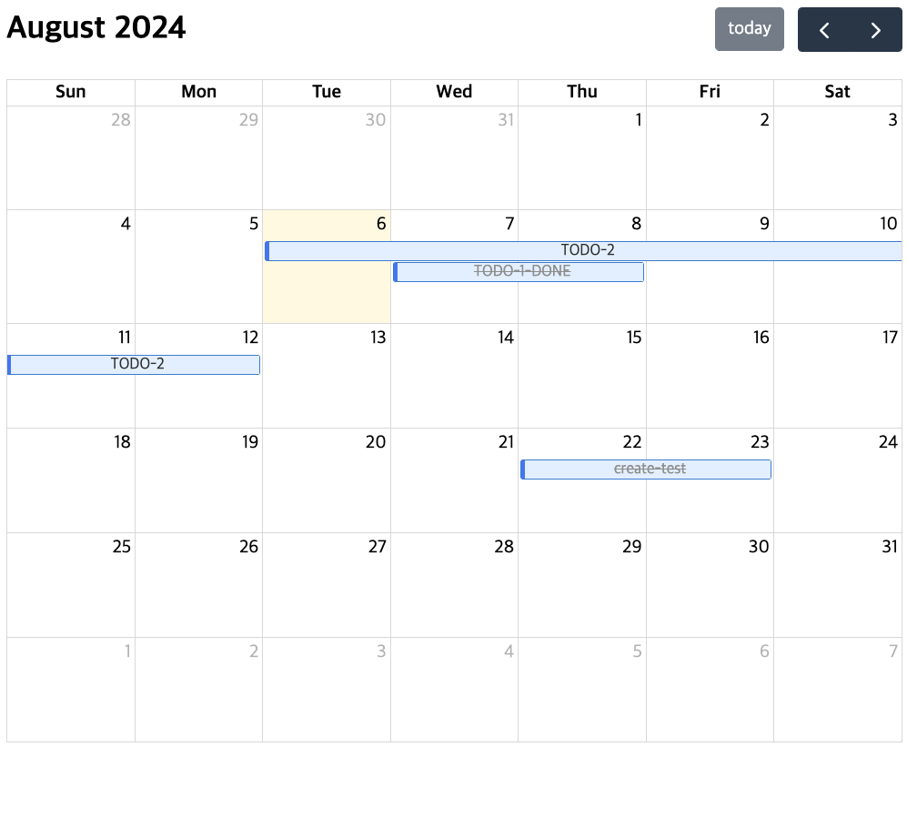

# SDN Service Onboarding Assignment
Spring Boot를 활용한 Simple Board Project

### 요구사항
- Spring Boot 3.3.X
- JDK 17+
- Spring Data JPA

### prerequisites
- openjdk17
- docker
- docker-compose

### 환경 구성 & 실행 방법
1. DB 사용한 로컬 환경 구성

다음 명령어를 실행해 MySQL을 docker에 올립니다.

```bash
sudo chmod 755 ./localenv/mysql/conf.d/my.cnf
docker-compose -f ./localenv/docker-compose.yaml --env-file ./localenv/local.env up -d
```

이후 아래 명령어를 사용해 DB에 접속할 수 있습니다.
```bash
docker ps
docker exec -it assign mysql -u root -p
# Enter password : password
```

2. 실행 방법
```bash
./gradlew clean build jacocoTestReport bootRun 
```

## 개요

네이버 개발자들이 애용하는 웍스의 **일정** 기능은 **할 일** 기능과 연동되어, 할 일에 작성한 내용이 달력에도 보입니다. 이렇게 작성한 **할 일**들은 달력에서 체크박스를 활용해 할 일의 완료 여부를 확인할 수 있습니다.

| 할 일                                | 일정                                    |
|------------------------------------|---------------------------------------|
|  |  |

그러나 웍스의 일정은 완료 여부를 체크할 수 없습니다. 당신은 이 불편함을 해소하기 위해 일정에 완료 여부를 체크할 수 있는 기능을 추가하고자 합니다.

### 목표
CRUD가 적용된 간단한 일정 관리 달력을 만드는 것이 목적입니다.

### API 목록
spring rest docs를 사용해 작성했습니다. `[서버 주소]/docs/index.html`에서 실행됩니다.

다음 링크에서도 확인할 수 있습니다. [API 문서](./readme/api_specification.pdf)

### 테스트 코드
테스트 커버리지는 `build/reports/jacoco/test/html/index.html`에서 확인할 수 있습니다.


### UI
#### 1. 조회
   - 달별 일정 조회 : `GET /schedule?year=2024&month=8`
   - 상세 일정 조회 : `GET /schedule/{id}`

| 달별 일정 UI                                        | 상세 일정 UI                                         |
|-------------------------------------------------|--------------------------------------------------|
|  |  |

#### 2. 일정 생성
  - `POST /schedule`

| 일정 생성 UI                                  | 일정 생성 결과 UI                                |
|-------------------------------------------|--------------------------------------------|
|  |  |

#### 3. 일정 삭제
  - `DELETE /schedule`

| 일정 삭제 UI                                  | 일정 삭제 결과 UI                                |
|-------------------------------------------|--------------------------------------------|
|  |  |

#### 4. 일정 수정
  - `PUT /schedule`

| 일정 갱신 UI                                  | 일정 삭제 결과 UI                                |
|-------------------------------------------|--------------------------------------------|
|  |  |

### 고려했던 것들
#### 예외처리
global exception handler를 사용해 한 파일 안에서 모든 예외를 handling하고, 예외를 던져야 하는 곳에서는 던지기만 하면 되는 구조를 생각했습니다.

#### API 문서 도구
swagger는 annotation이 운영 코드로 들어오게 되는데, 이 부분이 마음에 들지 않았습니다. API 문서를 작성하기 위해 테스트 코드 작성이 강제되는 spring rest docs를 사용했습니다.

#### API 테스트
.http client를 사용해 API 테스트도 코드로 관리할 수 있게 했습니다.

#### 로깅
시간 문제로 로그는 일단 콘솔과 파일에 작성하도록 했지만, 추후 Naver Cloud Log Analytics를 붙이면 될 것 같습니다.

#### spring profile 구성
DB, 로그 등등 사용하는 환경변수들은 로컬/개발/빌드/라이브 각각에서 달라야 합니다. 시간 문제로 profile을 도입하지 못했지만 환경에 따라 다르게 구축하면 될 것 같습니다.
